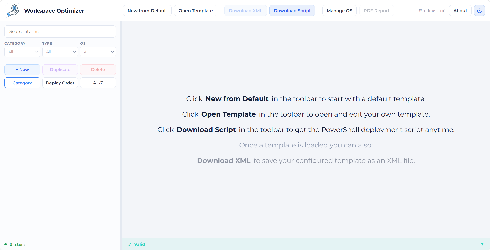
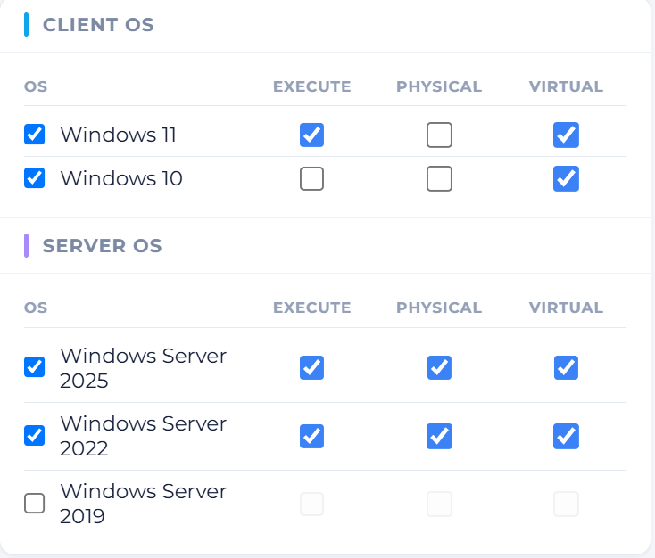

---
title: "Introducing: Workspace Optimizer"
date: 2026-07-03T20:00:00Z
lastmod: 2026-07-03T20:00:00Z
featureimage: ""
categories:
  - "VDI"
  - "Optimization"
  - "Windows"
tags:
  - "VDI"
  - "Optimization"
  - "PowerShell"
  - "Workspace"
---

When you build a new master image for a VDI environment, an SBC setup or a different kind of image, you need to apply certain optimizations to manage the resources better.
An optimized VDI image uses a lot fewer resources than an unoptimized one. Several tests from the past have already proven this:
* [Citrix Optimizer version 2 – Windows 10 1809](https://www.go-euc.com/citrix-optimizer-version-2-windows-10-1809/)
* [Windows 10 – 2004 – Benchmark – Optimized with VMware’s Operating System Optimization Tool (OSOT)](https://www.loginvsi.com/resources/blog/windows-10-2004-benchmark-optimized-vmware-2004-osot/)

There is also no general template or set of settings you can apply universally. Every environment is different, and so is your set of settings. Windows 11 needs different settings than a Server 2025 operating system. And depending on your deployment, you may already use Citrix Optimizer or the (VMware/Omnissa) OS Optimization Tool (OSOT). But what if you have a mixed environment or switch vendors? Are you going to keep using what you are used to? And when you have no active licenses for Citrix, you cannot update the Citrix optimization tool.

I noticed that a universal tool was missing, something vendor independent and open. So I created the Workspace Optimization Tool. With feedback from Bram Wolfs, owner of [AppVentiX](https://appventix.nl), I got the first version up and running. With this tool you don't have to download a piece of software to edit your template. You can do it straight from your own browser. All changes and edits are kept in your local browser, nothing is sent to a central server. If you want to offer this tool to your customers and host it yourself, that is also possible. Just fork this project and run your own version with your own domain name. You can even customize its appearance to better match your own corporate identity.

## Workspace Optimizer Site

You can go ahead to [Github](https://github.com/j81blog/WorkspaceOptimizer) and fork your own version or visit [my own hosted version available for you](https://workspaceoptimizer.j81.nl/).

> **NOTE**: The readme contains a list of variables to apply your own identity.

The solution is a website where you can create and edit your template (an XML file) and get the latest version of the script that works with that template.

The main buttons are located at the top, from left to right:
* **New from Default** - when you click this button, our default template is loaded.
* **Open Template** - with this you can open and edit your own template.
* **Download XML** - you can download an opened, created or edited template. If none is loaded, this button is disabled.
* **Download Script** - behind this button is the latest version of the script that runs the template.
* **Manage OS** - here you can define your own filter. Basic OS filters are already created.
* **PDF Report** - when you want a report of your settings, click this button. Make sure to load your template first, otherwise this function is unavailable.
* **"Windows.xml"** - the name of the loaded template.
* **About** - information about the creators.
* **Light/Dark-mode** - you can choose whether you like the site in dark or light mode.

At the left side you will find the template related options.



## OS Mapping

Each item has an OS mapping that controls on which operating systems the action runs and in what context.

The OS Mapping lists every OS the template supports, grouped into **Client OS** and **Server OS**. Each OS row has a leading checkbox (next to the OS name) plus three behavior checkboxes:


| Column        | Meaning                                                              |
| ------------- | ------------------------------------------------------------------- |
| *(OS name)*   | Include this OS in the item's mapping (unchecked = action does not apply) |
| **Execute**   | Whether the action is executed at all on this OS                    |
| **Physical**  | Applies when running on physical hardware                           |
| **Virtual**   | Applies when running in a virtual machine                           |

The item OS mapping shown below means the following:

* Windows 11 is supported and will be executed on virtual machines only.
* Windows 10 virtual machines are supported, but will not be executed.
* Windows Server 2022 and 2025 are supported and will be executed on both physical and virtual machines.
* Windows Server 2019 is not supported for this item.



An OS where the **Execute** checkbox is unchecked will **NOT** be executed when the script runs. The set of available operating systems is managed globally via **Manage OS** in the toolbar.

> **NOTE:** if both Physical and Virtual are unchecked, Execute is automatically forced off.

## Item types and their fields

In the left menu you will find the list of all the optimizations that can be applied. We currently support the following types:

* [Registry](#registry)
* [Service](#service)
* [Scheduled Task](#scheduled-task)
* [Store App](#store-app)
* [PowerShell](#powershell)
* [FileFolder](#filefolder)

### Registry

Reads or writes a Windows registry value.

| Field         | Description                                                         |
| ------------- | ------------------------------------------------------------------- |
| Hive          | `HKLM`, `HKCU`, `HKU`, or `HKU\DefaultUser`                         |
| Path          | Registry key path (without the hive)                                |
| Name          | Value name; leave empty for the default value                       |
| Action        | `SetValue`, `DeleteKey`, `DeleteKeyRecursively`, `DeleteValue`      |
| Value         | Data to write (for SetValue)                                        |
| Registry Type | `String`, `ExpandString`, `Binary`, `DWord`, `MultiString`, `Qword` |

### Service

Controls a Windows service.

| Field  | Description                       |
| ------ | --------------------------------- |
| Name   | Service name                      |
| Action | `Disabled`, `Automatic`, `Manual` |

### Scheduled Task

Enables or disables a scheduled task.

| Field  | Description                                      |
| ------ | ------------------------------------------------ |
| Name   | Task name                                        |
| Path   | Task folder path (e.g. `\Microsoft\Windows\...`) |
| Action | `Enabled`, `Disabled`                            |

### Store App

Removes a Windows Store / AppX package.

| Field | Description                         |
| ----- | ----------------------------------- |
| Name  | Package family name or display name |

### PowerShell

Runs a PowerShell script.

| Field  | Description                                                 |
| ------ | ----------------------------------------------------------- |
| Engine | `powershell` (Windows PowerShell) or `pwsh` (PowerShell 7+) |
| Script | The script content                                          |

> **NOTE**: To use PowerShell 7 (pwsh), you will have to install PowerShell 7 before running the script.

### FileFolder

Performs a file or folder operation.

| Field     | Description                      |
| --------- | -------------------------------- |
| Path      | Full path to the file or folder  |
| Action    | `Remove`, `Rename`               |
| Item Type | `File` or `Folder`               |
| New Name  | Required when Action is `Rename` |

## Order

You can set an **Order** number for each item individually. This determines the order in which the items are executed. The order can be anywhere between 1 and 99999. If you assign the same order number to multiple items, they are executed in alphabetical order by **Name**.

When you run the script, you can also include (`-IncludeOrder <nr>[,<nr>,<nr>]`) or exclude (`-ExcludeOrder <nr>[,<nr>,<nr>]`) order numbers. This way you can test or execute one or more items based on their order number.

## The Script

When you are finished editing the template, you want to apply it to, for example, your master image or your laptop deployment.
You can download the modified template by clicking the **Download XML** button, and grab the latest version of the script by clicking the **Download Script** button.
Save both files in a directory.

>**NOTE**: If you name the template `Windows.xml`, you don't have to specify the template. Otherwise you have to specify the `-FilePath <Template.xml>` parameter.

Once the script and template are ready, you can execute the script. In some environments you might want to adjust the execution policy.

```PowerShell
Set-ExecutionPolicy -ExecutionPolicy Bypass -Scope CurrentUser -Force
& .\Invoke-WindowsOptimization.ps1
```

This is the most basic command. It will pick up the `Windows.xml` template and execute all the items.

You can run the following command to see some more examples:

```PowerShell
Get-Help .\Invoke-WindowsOptimization.ps1 -Examples
```

I will keep improving this solution, and hopefully you can help out as well. That benefits me and the rest of the community!
Just raise an issue on Github if you run into a problem or have a suggestion. Any help or feedback is welcome!